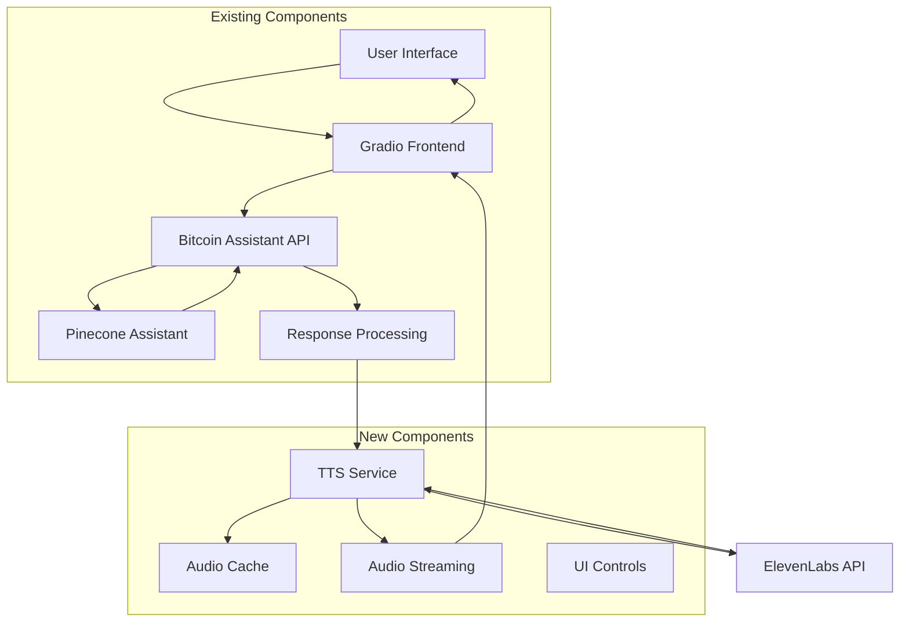

# Design Document

## Overview

This design outlines the integration of real-time text-to-speech functionality into the existing Gradio-based Bitcoin Knowledge Assistant interface. The system will leverage the ElevenLabs API to convert Pinecone Assistant responses to audio, providing users with an enhanced interactive experience through voice output. The implementation focuses on seamless integration, performance optimization through caching, and robust error handling.

## Architecture

### High-Level Architecture



### Component Integration Flow

1. **User Query** → Gradio Interface
2. **API Request** → Bitcoin Assistant API
3. **Knowledge Retrieval** → Pinecone Assistant
4. **Response Processing** → Extract main content, filter sources
5. **TTS Processing** → ElevenLabs API (with caching)
6. **Audio Streaming** → Gradio Audio Component
7. **User Controls** → Volume/Enable toggle management

## Components and Interfaces

### 1. TTS Service Module (`src/utils/tts_service.py`)

**Purpose**: Centralized service for text-to-speech operations with caching and error handling.

**Key Classes**:
- `TTSService`: Main service class
- `AudioCache`: In-memory cache for generated audio
- `TTSError`: Custom exception for TTS-related errors

**Interface**:
```python
class TTSService:
    def __init__(self, api_key: str, cache_size: int = 100)
    async def synthesize_text(self, text: str, voice_id: str = None) -> bytes
    def get_cached_audio(self, text_hash: str) -> Optional[bytes]
    def cache_audio(self, text_hash: str, audio_data: bytes) -> None
    def is_enabled(self) -> bool
```

### 2. Audio Processing Utilities (`src/utils/audio_utils.py`)

**Purpose**: Utilities for audio format conversion and streaming preparation.

**Functions**:
- `prepare_audio_for_streaming(audio_bytes: bytes) -> Iterator[bytes]`
- `convert_to_gradio_format(audio_bytes: bytes) -> str`
- `extract_main_content(response_text: str) -> str`

### 3. Enhanced UI Components (`src/web/bitcoin_assistant_ui.py`)

**Purpose**: Extended Gradio interface with TTS controls and audio streaming.

**New Components**:
- Voice enable/disable toggle
- Volume slider
- Audio output component with streaming
- Waveform animation indicator
- Error status indicator

### 4. Updated API Response Handler (`src/web/bitcoin_assistant_api.py`)

**Purpose**: Modified to support TTS integration and response filtering.

**Enhancements**:
- Response content filtering (remove sources)
- TTS service integration
- Async audio generation support

## Data Models

### TTS Configuration
```python
@dataclass
class TTSConfig:
    api_key: str
    voice_id: str = "JBFqnCBsd6RMkjVDRZzb"  # Default ElevenLabs voice
    model_id: str = "eleven_multilingual_v2"
    output_format: str = "mp3_44100_128"
    enabled: bool = True
    volume: float = 0.7
    cache_size: int = 100
```

### Audio Cache Entry
```python
@dataclass
class CacheEntry:
    text_hash: str
    audio_data: bytes
    timestamp: datetime
    access_count: int
    size_bytes: int
```

### UI State
```python
@dataclass
class UIState:
    tts_enabled: bool = True
    volume: float = 0.7
    is_synthesizing: bool = False
    error_message: Optional[str] = None
    last_response_hash: Optional[str] = None
```

## Error Handling

### Error Categories and Responses

1. **API Key Missing/Invalid**
   - Fallback: Disable TTS functionality
   - UI: Show configuration error tooltip
   - Logging: Warning level

2. **ElevenLabs API Unavailable**
   - Fallback: Muted state with red error icon
   - UI: Unobtrusive error indicator with tooltip
   - Retry: Exponential backoff for temporary failures

3. **Network Timeout**
   - Fallback: Cancel synthesis, show text only
   - UI: Brief error message, auto-hide after 5 seconds
   - Retry: Single retry attempt

4. **Audio Format/Streaming Errors**
   - Fallback: Disable audio for current response
   - UI: Show format error indicator
   - Logging: Error level with details

### Error Recovery Strategy
```python
class TTSErrorHandler:
    def handle_api_error(self, error: Exception) -> TTSFallbackAction
    def should_retry(self, error: Exception, attempt: int) -> bool
    def get_fallback_state(self, error_type: str) -> UIState
```

## Testing Strategy

### Unit Tests
- **TTS Service**: API integration, caching logic, error handling
- **Audio Utils**: Format conversion, content extraction
- **UI Components**: Control interactions, state management
- **Error Handling**: All error scenarios and fallbacks

### Integration Tests
- **End-to-End Flow**: Query → Response → TTS → Audio playback
- **Cache Performance**: Cache hit/miss scenarios
- **API Failure Simulation**: Network errors, API limits
- **UI Responsiveness**: Audio controls during synthesis

### Performance Tests
- **Cache Efficiency**: Memory usage, eviction policies
- **Streaming Latency**: Time to first audio chunk
- **Concurrent Users**: Multiple simultaneous TTS requests
- **Memory Leaks**: Long-running sessions with audio caching

### Test Data
- **Sample Responses**: Various lengths and content types
- **Edge Cases**: Empty responses, very long text, special characters
- **Error Scenarios**: Invalid API keys, network failures
- **Audio Formats**: Different output formats and quality settings

## Implementation Phases

### Phase 1: Core TTS Integration
- Implement `TTSService` with basic ElevenLabs integration
- Add audio caching mechanism
- Create audio utilities for format conversion
- Basic error handling and fallbacks

### Phase 2: UI Enhancement
- Add TTS controls to Gradio interface
- Implement audio streaming component
- Add waveform animation during synthesis
- Integrate volume control and enable/disable toggle

### Phase 3: Advanced Features
- Implement response content filtering
- Add sophisticated error handling with user feedback
- Optimize caching strategy and memory management
- Performance monitoring and logging

### Phase 4: Polish and Optimization
- Fine-tune audio quality and streaming performance
- Comprehensive error recovery mechanisms
- User experience improvements
- Documentation and deployment preparation

## Security Considerations

### API Key Management
- Environment variable storage only
- No API key logging or exposure
- Secure transmission to ElevenLabs API

### Content Filtering
- Sanitize text before TTS synthesis
- Prevent injection attacks through response content
- Validate audio data before streaming

### Resource Management
- Cache size limits to prevent memory exhaustion
- Request rate limiting for ElevenLabs API
- Timeout controls for long-running synthesis

## Performance Optimization

### Caching Strategy
- **LRU Cache**: Least Recently Used eviction policy
- **Hash-based Keys**: SHA-256 of cleaned response text
- **Memory Limits**: Configurable maximum cache size
- **Persistence**: Optional disk-based cache for frequently accessed content

### Streaming Optimization
- **Chunked Streaming**: Stream audio as it's generated
- **Buffer Management**: Optimal buffer sizes for smooth playback
- **Compression**: Use efficient audio formats (MP3 with appropriate bitrate)
- **Preloading**: Cache common responses proactively

### Resource Management
- **Connection Pooling**: Reuse HTTP connections to ElevenLabs
- **Async Processing**: Non-blocking TTS synthesis
- **Memory Monitoring**: Track cache memory usage
- **Cleanup**: Automatic cleanup of temporary audio files